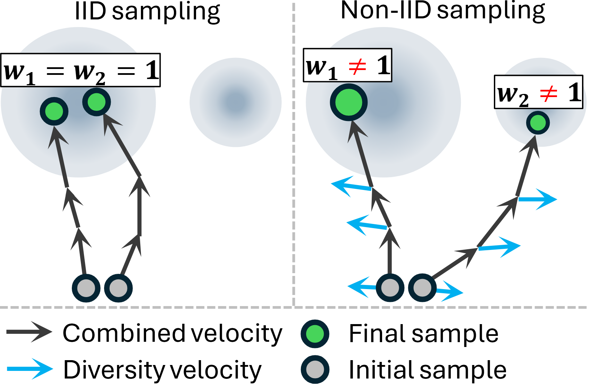

# SRIW-Flow: Score-Regularized Joint Sampling with Importance Weights for Flow Matching

[Homepage](https://XinshuangL.github.io/SRIW-Flow) | [Paper](https://arxiv.org/abs/2511.17812)

Official implementation of the paper "Score-Regularized Joint Sampling with Importance Weights for Flow Matching."

  
   
   <small><em style="line-height:1.5;"><strong>Illustration of importance-weighted non-IID sampling.</strong> Under IID sampling, both samples are likely drawn from the same dominant mode. In contrast, diversity velocity encourages samples to diverge along their trajectories, leading to coverage of multiple modes. To correct the resulting sampling bias, importance weights are required. Intuitively, w_1 &gt; 1 &gt; w_2, since non-IID sampling draws the second sample from a minor mode.</em></small>

Code coming soon!
